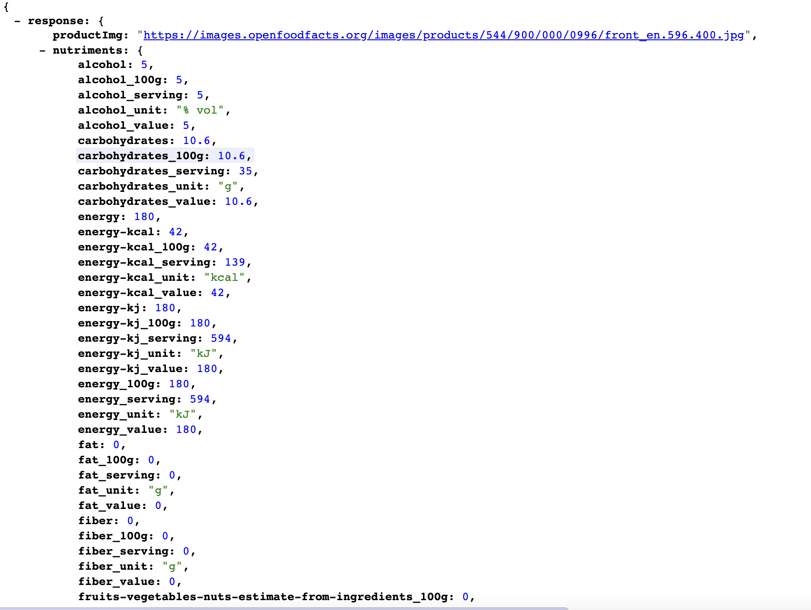
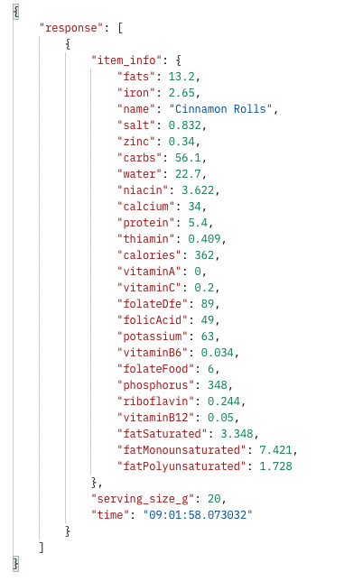
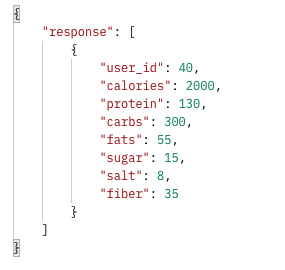

# Nutribud Backend Documentation

## Contents

## Introduction

This is the backend server of the Nutribud desktop app that handles http requests from the client to retrieve nutrition information and user performance, as well as post user goals and information.

## Technologies

This repository uses [node](https://nodejs.org/api/) to run its files. The Node web framework [Express](https://expressjs.com/) was used to write the endpoint paths and handlers. For our database we use [PostgreSQL](https://www.postgresql.org/) to store user data online using [ElephantSQL](https://www.elephantsql.com/). For voice and text searches we use Edamam's [Food and Grocery Database API](https://developer.edamam.com/food-database-api). For barcode searches we use [Open Food Facts API](https://openfoodfacts.github.io/api-documentation/)

## Launch

There is another repository which is closely related and can be found [here](https://github.com/Sigma-Labs-XYZ/nutribud-frontend). It is recommended that you create a folder and clone both the frontend and backend repos into the same folder.

Start by forking this backend repository, and then cloning the repository into your local drive. Toggle into the directory, /nutribud-backend, and run the following command into your terminal to initiate the backend server:

`node server.js`

The frontend React application requires this backend server to be running to work correctly as it uses http://localhost:8080 as the API link in the development environment variables.

## Database Schema

## Server Endpoints

### /login

The `/login` endpoint handles adding an existing user's id to the sessions table along with the cookie session id, deleting a user from the sessions table as well as verifying a user is logged in.

#### Logging In

Logging in is done with the POST HTTP Method to the `/login` endpoint.

The body of the POST request **_must_** contain:

- username
- password

Example of a fetch request:

```
await fetch(`http://localhost:8080/login`, {
    method: "POST", credentials: "include",
    headers: { "Content-Type": "application/json", },
    body: JSON.stringify({
        username:'admin',
        password:'somePassword',
    }),
});
```

If the username is not registered or the password is wrong the server will respond with a 400 status code (bad request).

#### Logging Out

Logging out is done with a DELETE HTTP Method to the `/login` endpoint.

Example of a fetch request:

```
await fetch(`http://localhost:8080/login`, {
    method: "DELETE", credentials: "include",
    headers: { "Content-Type": "application/json", },
});
```

If the user is not logged in the server will respond with a 400 status code (bad request).

#### Verifying a User is Logged In

Verifying a user is logged in is done with a GET HTTP Method to the `/login` endpoint.

Example of a fetch request:

```
await fetch(`http://localhost:8080/login`, {
    method: "GET", credentials: "include",
    headers: { "Content-Type": "application/json"},
});
```

### /register

The `/register` endpoint handles adding a new user to the users table.

This is done with a POST HTTP Method to the `/register` endpoint.

The body of the POST request **_must_** contain:

- username
- password
- passwordConfirmation

Example of a fetch request:

```
await fetch(`http://localhost:8080/register`, {
    method: "POST",
    credentials: "include",
    headers: {"Content-Type": "application/json"},
    body: JSON.stringify({
        username:'admin',
        password:'somePassword',
        passwordConfirmation:'somePassword',
    }),
});
```

If the username is already registered or the passwords do not match the server will respond with a 400 status code (bad request).

### /search-text

The `/search-text` endpoint handles requests to Edamam's [Food and Grocery Database API](https://developer.edamam.com/food-database-api) and returns nutritional information for a given item.

This is done with a GET HTTP Method and the following query parameter:

- item

Example of a fetch request:

```
await fetch(`http://localhost:8080/search-text?item=${encodeURIComponent('bread')}`);
```

If the fetch request does no have an item query parameter the server will respond with a 400 status code (bad request).

Example response:


### /search-barcode

The `search-barcode` endpoint handles requests to [Open Food Facts API](https://openfoodfacts.github.io/api-documentation/) and returns nutritional information for a given item.

This is done with a GET HTTP Method and the following query parameter:

- barcode

Example of a fetch request:

```
await fetch(`http://localhost:8080/search-text?barcode=${5449000000996}`);
```

Example response:



### /tracking

The `/tracking` endpoint handles adding item information to the tracked_items and user_history tables and retrieving item history for a given user.

#### Tracking an item

Tracking an item is done with a POST HTTP Method to the `/tracking` endpoint.

The body of the POST request **_must_** contain:

-itemInfo
-amount

Example of a fetch request:

```
await fetch(`http://localhost:8080/tracking`, {
    method: "POST",
    credentials: "include",
    headers: {"Content-Type": "application/json"},
    body: JSON.stringify({
        itemInfo: {
            name: "Bread",
            nutriments: {
                Energy: 267,
                Protein: 10.72,
                Total lipid (fat): 3.24,
                Carbohydrate, by difference: 48.68,
            },
        amount: 50
        }
    }),
});
```

If no current user is in the sessions table server will return an error message `{ error: "Need to be logged in to track items."}`

#### Retrieving Tracked User Items

Retrieving the items a user has tracked is done with a GET HTTP Method to the `/tracking` endpoint and the following query parameter:

- date

Example of a fetch request:

```
await fetch (`http://localhost:8080/tracking?date=2022-06-09`,{
    method: "GET",
    credentials: "include",
    headers: { "Content-Type": "application/json"},
});
```

Example response:



### /goals

The `/goals` endpoint retrieves the goals a user has set and updates the user_goals table with new goals.

#### Updating User Goals

Updating a users goals is done with a PATCH HTTP Method to the `/goals` endpoint.

The body of the PATCH request **_must_** contain:

- calories
- protein
- carbs
- fats
- sugar
- salt
- fiber

Example of a fetch request:

```
await fetch(`http://localhost:8080/goals`, {
    method: "PATCH",
    credentials: "include",
    headers: {"Content-Type": "application/json"},
    body: JSON.stringify({
        calories:2000,
        protein:200,
        carbs:100,
        fats:100,
        sugar:50,
        salt:5,
        fiber:100,
    }),
});
```

If no current user is in the sessions table server will return an error message `{ error: "Login to update nutrition goals"}`

#### Retrieving User Goals

Retrieving the goals a user has set is done with a GET HTTP Method to the `/goals` endpoint.

Example of a fetch request:

```
await fetch(`http://localhost:8080/goals`, {
    method: "GET",
    credentials: "include",
    headers: {"Content-Type": "application/json"},
});
```

Example response:



### /user-info

The `/user-info` endpoint handles user information such as weight, height, name, gender. The endpoint handles setting, retrieving and updating the information.

#### Setting User Information

Setting the user information is done with a POST HTTP Method to the `/user-info` endpoint.

The body of the POST request **_must_** contain:

- name
- age
- weight
- height
- gender

Example of a fetch request:

```
await fetch(`${process.env.REACT_APP_API_URL}/user-info`, {
    method: "POST",
    credentials: "include",
    headers: {"Content-Type": "application/json",},
    body: JSON.stringify({
        name:'admin',
        weight:70,
        height:165,
        age:25,
        gender:f}),
});
```

#### Updating User Information

Setting the user information is done with a PATCH HTTP Method to the `/user-info` endpoint.

The body of the PATCH request **_must_** contain:

- name
- age
- weight
- height
- gender

Example of a fetch request:

```
await fetch(`${process.env.REACT_APP_API_URL}/user-info`, {
    method: "PATCH",
    credentials: "include",
    headers: {"Content-Type": "application/json",},
    body: JSON.stringify({
        name:'admin',
        weight:70,
        height:165,
        age:25,
        gender:f}),
});
```

#### Retrieving User Information

Setting the user information is done with a GET HTTP Method to the `/user-info` endpoint.

Example of a fetch request:

```
await fetch(`${process.env.REACT_APP_API_URL}/user-info`, {
      method: "GET",
      credentials: "include",
      headers: { "Content-Type": "application/json",},
});
```

Example response:


### /performance-history

The `/performance-history` endpoint handles tracking how complete the user's goals are by updating their performance score in the user_perf table as well as retrieving performance history.

#### Updating Performance Score

Updating the performance score is done with a POST HTTP Method to the `/performance-history` endpoint.

The body of the POST request should contain:

- score (required)
- date (if missing current date is used)

Example of a fetch request:

```
await fetch(`${process.env.REACT_APP_API_URL}/performance-history`, {
      method: "POST",
      credentials: "include",
      headers: {
        "Content-Type": "application/json",
      },
      body: JSON.stringify({ score: 69 }),
    });
```

#### Retrieving Performance Score

Retrieving the performance score id done with a GET HTTP Method to the `/performance-history` endpoint and 2 optional parameters

## Packages installed:

- npm install express
- npm install cookie-parser
- npm install cors
- npm i pbkdf2-password-hash
- npm install pg
- npm install bcrypt
- npm install crypto
- npm install jest --save-dev
- npm install supertest --save-dev
